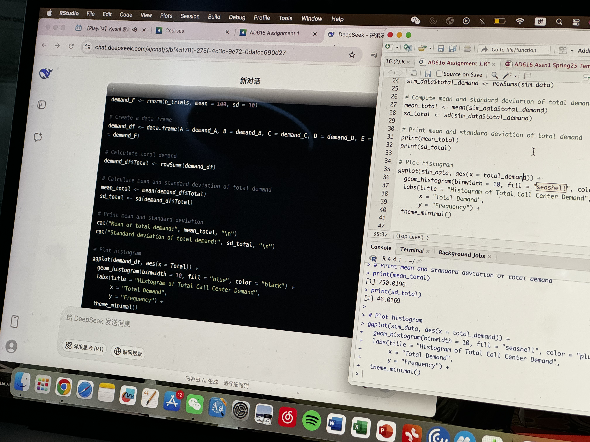
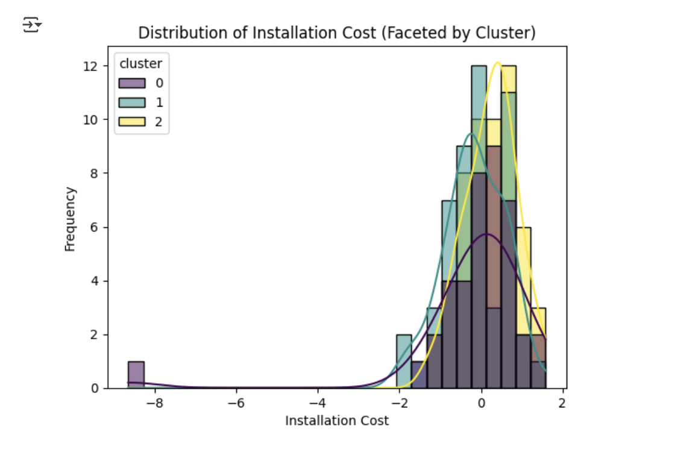

# Projects

This page showcases some of my major academic and personal projects. Below are a few examples:

## Project Example 1: Data Analysis Project
**Description:** Utilized R Studio and Python to clean, model, and visualize large datasets, helping the organization make data-driven decisions.  
**Outcome:** Improved decision-making efficiency and received positive feedback from both mentors and industry partners.

## Project Example 2: Marketing Analytics Project
**Description:** Performed data mining and analysis on online marketing data to suggest optimization strategies.  
**Outcome:** Successfully secured additional investment for the subsequent phases of the project.

